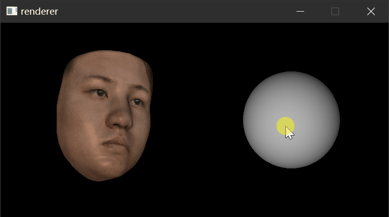

**Some old stuff.** In case you want to render [VRN](https://github.com/AaronJackson/vrn) produced face model with different lighting condition. 




## Build the Renderer

Following build instruction only tested on Windows 10 with lastest Visual Studio 2017

``` pwsh
cd Renderer

mkdir build
cd build
cmake .. -G "Visual Studio 15 2017 Win64"
cmake --build . --config Release -- /m

mkdir ../../bin
cp ./Release/renderer_bin.exe ../../bin
cp ./stb_image/Release/igl_stb_image.dll ../../bin
cp ../*.glsl ../../bin
```

## Python dependencies

- mxnet
- PyMCubes
- pypng
- [pytorch=0.41](https://pytorch.org/get-started/previous-versions/) (the VRN model is converted from lua torch, and is dependent on legacy layer)


## Run

To generate the face model and diffuse image.
```
python im2obj.py -i <image>
```

To Run `bin/renderer_bin`, double click `renderer.bat`

```
Press 1~5   for preset lights
      T     for texture
      R     reset to unsmoothed model
      Space for one iteration of smoothing

Drag on the ball to adjust light
```